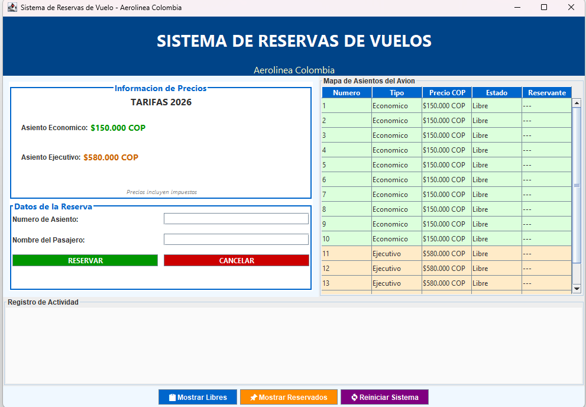
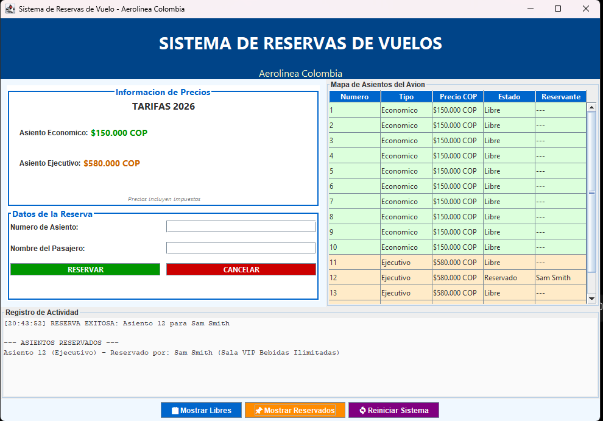
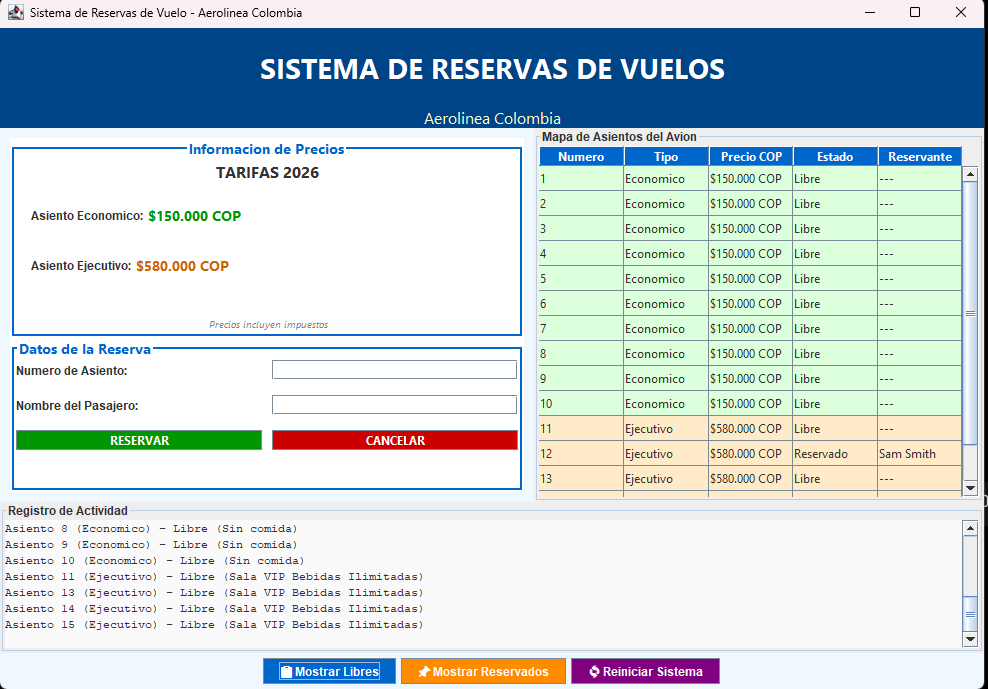

# ✈️ Sistema de Reservas de Vuelos

Aplicación desarrollada en Java que permite gestionar la reserva y administración de asientos en vuelos comerciales mediante una interfaz gráfica construida con Java Swing.

## 📋 Descripción

Este proyecto fue desarrollado como parte de mi formación en Desarrollo de Software, aplicando conceptos de Programación Orientada a Objetos (POO) para modelar la gestión de vuelos y reservas de asientos.

La aplicación permite administrar asientos de diferentes categorías, consultar disponibilidad y realizar reservas de forma sencilla mediante una interfaz gráfica intuitiva.

## 🎯 Objetivo

Desarrollar una aplicación que permita gestionar la reserva de asientos en vuelos comerciales, aplicando principios de Programación Orientada a Objetos y diseño de interfaces gráficas en Java.

## 🚀 Funcionalidades

* Reserva de asientos.
* Consulta de disponibilidad.
* Gestión de asientos económicos y ejecutivos.
* Administración de información de vuelos.
* Interfaz gráfica desarrollada con Java Swing.

## 🛠️ Tecnologías Utilizadas

* Java
* Java Swing
* NetBeans
* Programación Orientada a Objetos (POO)

## 📚 Conceptos Aplicados

* Herencia
* Polimorfismo
* Encapsulamiento
* Clases abstractas
* Colecciones (ArrayList)

## 📸 Capturas de Pantalla

### Pantalla Principal

### Reserva de Asientos

### Consulta de Disponibilidad

## ▶️ Ejecución

1. Abrir el proyecto en NetBeans.
2. Compilar el proyecto.
3. Ejecutar la aplicación desde la clase principal.

## 👨‍💻 Autor

**Esteban Palacio**

Técnico en Análisis y Desarrollo de Software (CENSA) y estudiante de Tecnología en Desarrollo de Software en la Institución Universitaria Pascual Bravo.

### Contacto

* LinkedIn: Agregado en mi perfil de GitHub.
* Ubicación: Medellín, Colombia.
